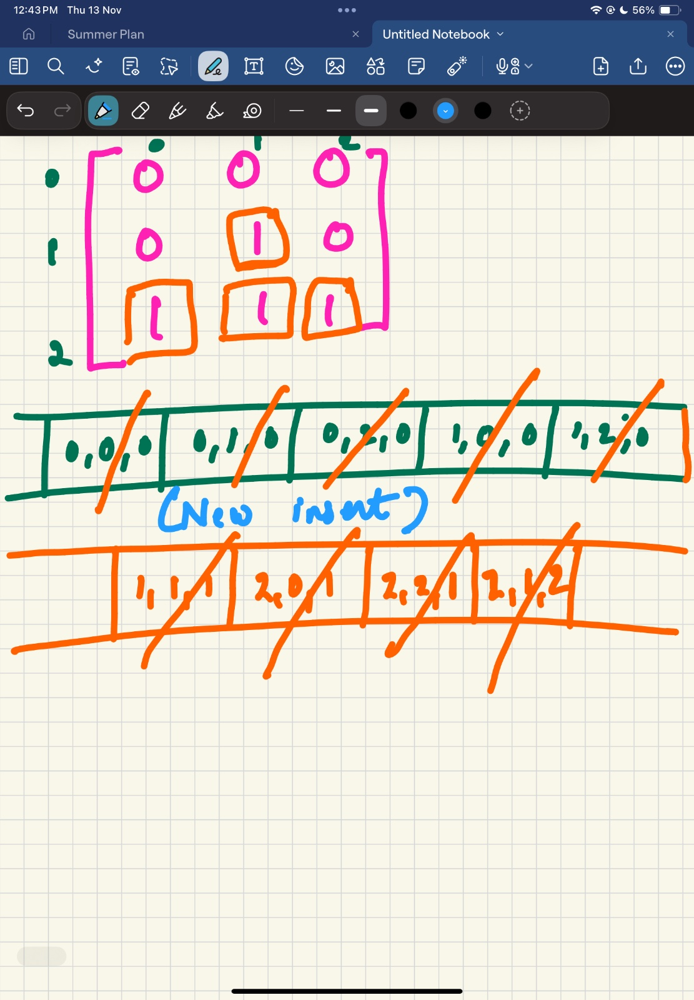

ROTTEN ORANGES:

Initial thought was to use DFS but if i choose one rotten orange and make a DFS call, in one call it will make all the fresh one rotten (connected)
but we also want to find minimum time and we will not be able to calculate that.
If the question would be like just return true or false if all the cells will be rotten, then DFS would be the best choice here

Its a multi source BFS problem, If there are more than 1 rotten oranges in the start then 
we cannot choose one rotten orange and start because it is asking for minimum time.
BFS will start simultaneously from all rotten orange.

Add all rotten oranges to the queue.

Remove the first element and make all the oranges rotten by doing all four direction call, keep adding the element in the queue.

do this until the queue is empty.

While you are doing this, initially count the fresh oranges and keep decreasing the oranges as you make it rotten

if fresh==0 then return the maximum time else return -1

Total Time Complexity = O(m × n)

Total Space Complexity = O(m × n)

SHORTEST PATH IN THE MATRIX:

very similar to the rotten orange problem

Dfs wont work because it is asking for shortest path but dfs will give you all path ( shortest or longest)

if grid[0][0] ==1 or grid[destination][destination]==1 return -1

put(0, 0, 1 ) in the queue

Make 8 direction call and keep putting the valid cell (0) or neighbour

Pop (0, 0 ,0) and move on 

process next element 

if we have reached destination stop else return -1

01 MATRIX

in this problem we have to find the distance of nearest zero for each cell

if the cell is already zero then we don't need to find it

focus on cell which are 1 

so i reversed the approach, I tried finding nearest 1 from 0

Put all 0 in the queue shown in green.

Start with (0,0,0), see if you find 1 in the neighbour, there are none so pop it and move on

go with (0,1,0), we can see 1 so update the distance to 1 and put(1,1,1) in the queue

continue it till the queue becomes empty

problem is very similar to the ROTTEN ORANGES, SHORTEST PATH IN THE MATRIX

Total Time Complexity = O(m × n)

Total Space Complexity = O(m × n)

OPEN THE LOCK:

start with 0000, get next combination 

There will be 8 next combination- clockwise(1000,0100,0010,0001) and anticlockwise(9000,0900,0090,0009)

keep putting the element in the queue as well as visited set

skip if we encounter deadEnds 

return if we encounter the target

Time Complexity: 0(10000)

Space Complexity: 

