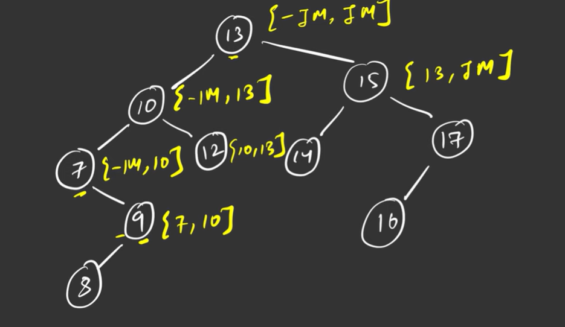

**Validate a Binary Tree**

at each level define the max and min range

Lets say i want to process the left subtree

min= can be anything 

max=13 (why because when we traverse left subtree all the element should be lesser than 13)

Now in the right subtree 

min=13(because all the element should be greater than 13)
max= can be anything 

Time Complexity:
O(n)

Space Complexity: O(h) due to recursion stack(h is the height of the tree)