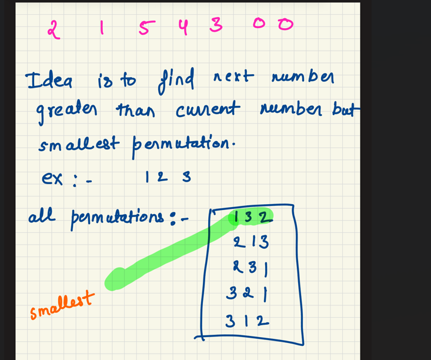
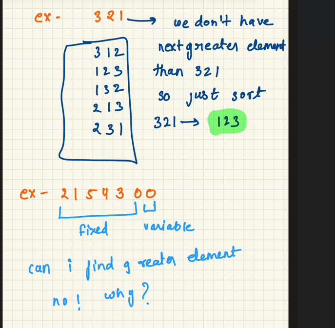
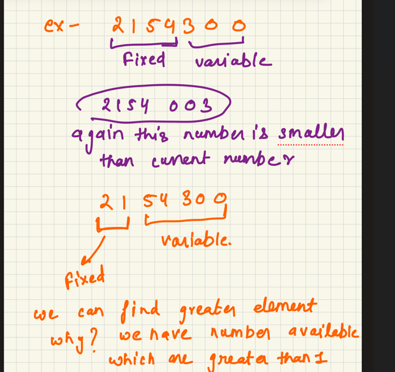
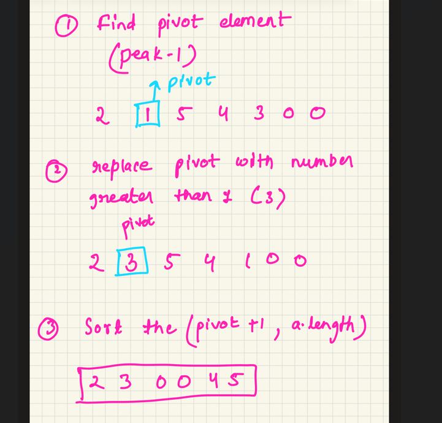

Next Permutation 

It was difficult to even come up with the solution. We always have to find find greater number than 
current and next smaller permutation 

int [] num={2,1,5,4,3,0,0}}

see the dip 

at dip, find number which can be replaced with the dip

dip<number

dip - 1 

replace dip with 3

sort from dip+1 to arr.length()

we actually dont need to write sort method since after the dip the numbers
will be sorted so just swap left(dip+1) and right(last)

