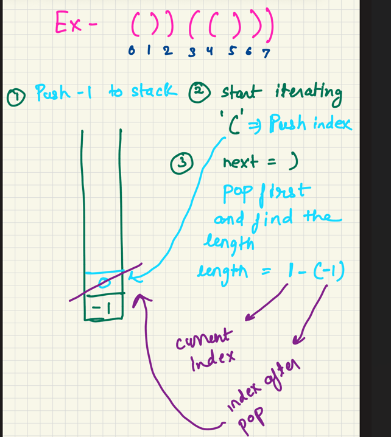
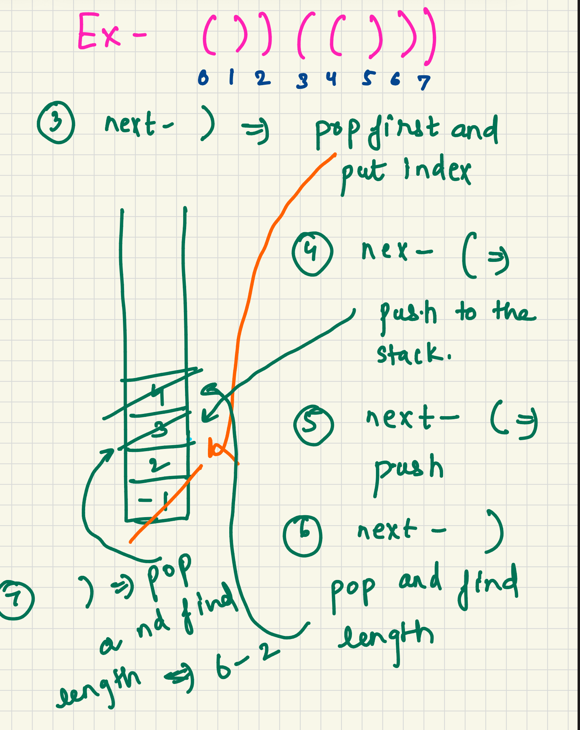
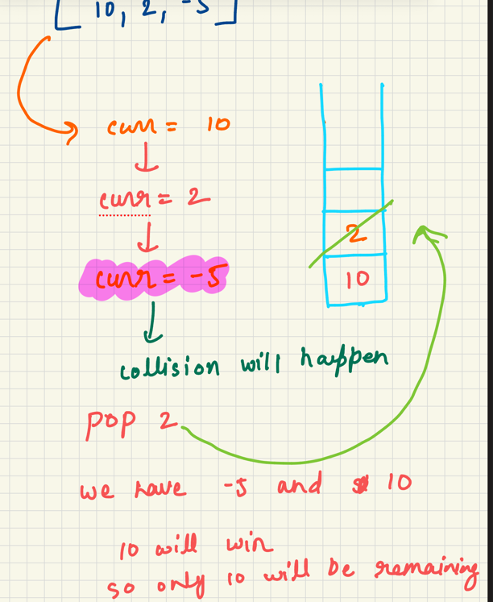
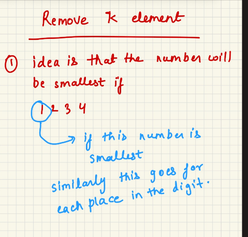
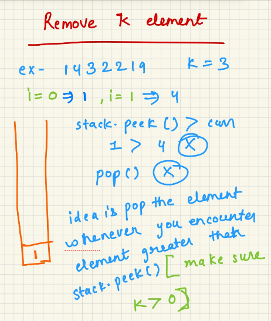
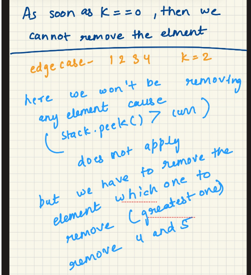

Longest Valid Parenthesis:

Whenever we see (  push its index

Whenever we see ) pop it and find the length

but slight change 

if the stack is empty, push ) index too to reset but before that whenever you see
) always pop first

Asteroid Collision 

Remove K Digits

put one element and then later make sure you are keeping the smallest number possible keeping k in limit

Next Greater Element I

Start with the last element.

Only add numbers to the stack that are greater than the current element.

If the stack is empty, set ans = -1 because there is no greater element.

If the stack is not empty and stack.peek() , then set ans = stack.peek().

If the stack is not empty and stack.peek() ≤ curr, then pop().

Next Greater Element II

same concept as Next Greater Element I only difference is first we put all the element in the stack starting from the last

keep element greater than current element in the stack(same logic )