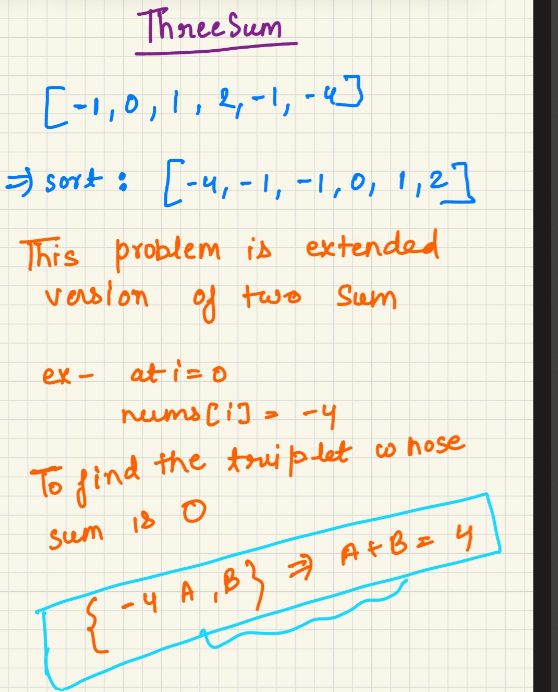

3 sum:

overall the learning is keep revising 

extend this problem using two sum , how in two sum we used to fix one number and used to find complement(target-currentNum) in the array ahead 
similarly here also fix one pointer and use two sum to find other two pair, make sure you are not adding duplicate number to the triplet

how ? 

i>0 && nums[i]==nums[i-1] skip - this logic will be applied in two sum also 

