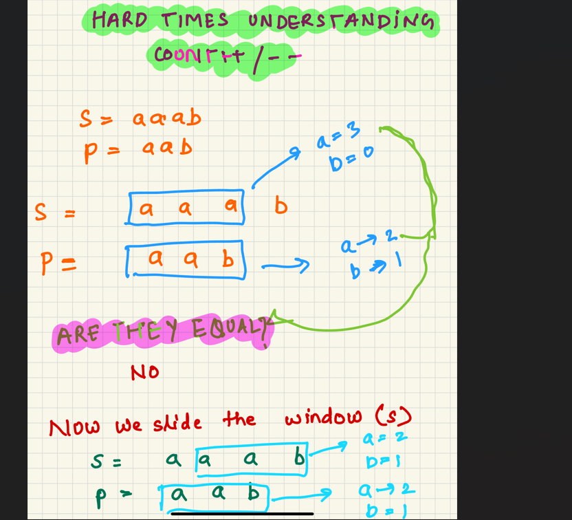
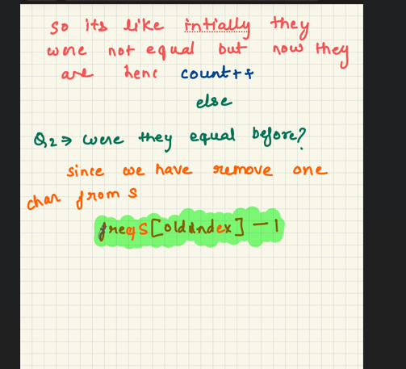

Frequency of the Most Frequent Element

What a question! Initially i thought its an easy sliding window question but while writing code i was only able to pass 11 testcase.

My initial thought process was:

[1,2,4], k=5: If I am at 2, can i make 1 qual to 2 and still have k left?

yes, I can : k=4 left

now i move to 4. Can i make all the element present before 4 equal to 4 ?

yes, I can : k=0 left 

This logic will not work for more testcase , i found one testcase but it was too long so i could not check manually.

----END---

[1,1,1,2,2,4] ,     k=2

Whenever we see that we will have to use sliding window, start with finding valid window and keep calculating the length of the window and once you encounter the invalid window, you shrink it.

VALID WINDOW:

[1,1,1,2,2,4]:  

left==0 and right==2

If this window is valid then before index=2, all element would be 2

[2,2,2]--> ideal_sum=6

but actual_sum is 3

so if (ideal_sum-actual_sum<=k) ---valid

INVALID WINDOW:

[1,1,1,2,2,4]:  

left==0 and right==3

ideal_sum= 8

actual_sum=5

(ideal_sum- actual_sum)= 3, means in order to make it a valid window i have to do atleast 2 moves which i cannot do because my k==2

shrink the window, update actual_sum and ideal_sum

phewww

Permutation of the String: 

Intial thought process: I calculate the window length which will be equal to the length of s1

i iterate through s2 and go till that window length , sort that part of the substring and compare with s1 that would be too much
Take the substring and sort it -0(mlogm)—> if the size of window is m

suppose there are n windows —→0(nmlogm)

We want O(n)

similar to anagram

Find Anagram in a string 

this problem was very similar to permutation in String. Had hard time understanding when to increaseor decrease the counter. 
Problem looked easy on paper. So the idea is one window is fixed which is p's 
so you count the element in that window and stores their frequency. Now count the first window in s and store the frequencies

ex-
s="aaab"

p="aab"

freqS= a-->3

freqP= a-->2 b-->1

we check the count if they are equal if yes then "ANAGRAM"

now we move window 

new window for s --> "aab"   freqS=a-->2 b-->1

removed char =a and its current count is equal to a count in p so count++

added char = b and its previous count (b=1) in p and current count in s(b==1) is equal so count++ again

count=26 

hence anagram 
      

