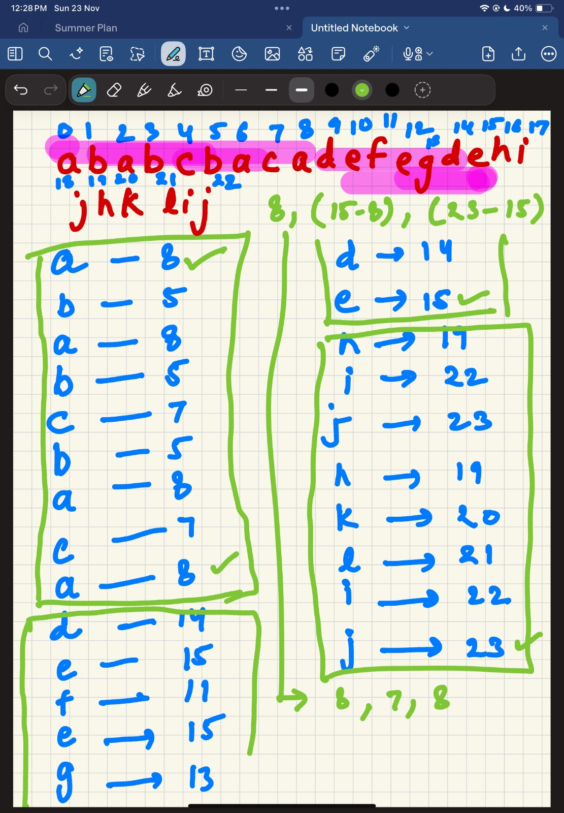

MAXIMISE THE TOPMOST ELEMENT AFTER K MOVES

this question is full of testcases

we are trying to maximise the top element here 

edge cases: When size of array==1 and k>1

nums= {1} k=1

remove 1 and you cannot add back any element because you dont have any element to add.

nums= {1} k=2

remove 1 still i have one more move left so we can add back 1 to it and that would an answer

nums= {4,2,1} k==3

remove 4, 2,, we can add back 4 and that would be the answer

nums= {4,2,1} k==4

remove 4,2,1 we can add back 4 

nums={5,2,2,4,0,6} k==4

remove 5,2,2 and add back 5

It took me lot of trials to pass all the testcases

QUEUE RECONSTRUCTION BY HEIGHT

I started sorting the array by height in decreasing order

but what about when heights are equal then sort the array by positioning in increasing order

people = [[7,0],[4,4],[7,1],[5,0],[6,1],[5,2]]

after sort

[ [7,0], [7,1], [6,1], [5,0], [5,2], [4,4] ]

Now we ask like this:

[7,0]--i want 0 tall people in front of me so lets put this on the 0th index.

[7,1]-- I want to have 1 tall(or same height) people in front of me. put me at 1st index.

[7,0],[7,1]

[6,1]-- I want 1 tall person in front of me so i will put this at index 1 but element which is already present will be shifted.

[7,0],[6,1],[7,1]

[5,0]-- I want 0 tall person in front of me so put me at index 0

[[5,0], [7,0], [6,1], [7,1]]

[5,2]-- I want 2 tall person in front of me so put me at index 2

[[5,0], [7,0], [5,2], [6,1], [7,1]]

[4,4]--I can afford to have 4 tall or same height person in front of me so put me at index 4th

[[5,0], [7,0], [5,2], [6,1], [7,1], [4,4]]

start learning lambda function in java properly

TWO CITY SCHEDULING:

TASK SCHEDULER:

pick the task with the highest frequency why? Its like how i finish off the task which is the difficult first thing in the morning

If you pick the highest frequency task first, it will minimize the idle time and thats our goal.

Coding was bit difficult:

create freqArray with character and their frequency. ex-[A A A B B B] n = 2

A:3 B: 3

Iterate through the freqArray and get the frequency of all tasks and put it in the max_heap

[3,3]

Define Window= n+1 

A _ _ A so the window is 3 here

Now get the most frequent element and start diving the task

[2,2]-> [1,1]->[0]

LONGEST HAPPY STRING 

very similar to task schedule, tough to code 

a = 1, b = 1, c = 7

put all the element with char and their count in a priority queue

((c,7),(a,1),(b,1))--> element which most frequency will be at the top

take out the most frequent element--> c, 7

if the length< 2 or get last two char c1, c2, if it is not equal to current char which is empty here

simply append to the stringbuilder and decrement the count

string--> c : (c,6)

push it back to the max_heap (c,6),(a,1)(b,1) : StringBuilder= c

get the most frequent element : (c,6)

length<2 so simply append to the stringbuilder, decrement the frequency and push it back to the max heap

curr: (c,5),(a, 1),(b,1) : stringBuilder= cc

get the most frequent element : (c, 5)

Now length==2 && last two chars are equal to curr char which is c so now its time that we pick next frequent element and append it to the stringbuilder

get next frequent element : (a, 1)-> append to the stringbuilder, decrement the frequency and push it to the maxheap(if updatedfrequency>0)

stringbuilder=ccb

get the most frequent element : (c, 5)

length>2 but last two chars are not equal to curr char which is c right now hence just append it, decrement the counter

stringbuilder=ccbc

get the most frequent element : (c, 4)

length>2 but last two chars are not equal to curr char which is c right now hence just append it, decrement the counter

stringbuilder=ccbcc

get the most frequent element : (c, 3)

length>2 and last two chars are  equal to curr char which is c right now so now its time that we pick next frequent element and append it to the stringbuilder

stringbuilder=ccbcca

get the most frequent element : (c, 3)

length>2 but last two chars are not equal to curr char which is c right now hence just append it, decrement the counter

stringbuilder=ccbccac

get the most frequent element : (c, 2)

length>2 but last two chars are not equal to curr char which is c right now hence just append it, decrement the counter

stringbuilder=ccbccacc

Thats it

REORGANIZED STRING:

it is very similar to LONGEST HAPPY STRING 

Hands of Straight

This question was merely simple but i made it complicated by using min heap 

simply take a hashmap and put number and frequency and sort it by number so that minimum no is at the start 

or 

Use TreeMap

create a window of groupSize [1,2,3,4,5]

groupSize=4

get 1 --> 2 is present --> 3 is present --> 4 is present (group size over)

get 5 --> 6 is not present so return false

very simple

Valid parenthesis String

found it simple

ex: s = "(*))"

keep track of left parenthesis(index)

keep track of * (index)

once we encounter right parenthesis check left parenthesis first (pop it)

if left parenthesis is empty then check star stack and pop it

if both of them are empty then we know for sure that it cannot be balanced

lastly if there are elements in right parenthesis and * , check if they can be balanced with each other

make sure that index of ( comes first then *

time complexity : 0(N)

PARTITION LABELS :

Store the last index of each letter

a=8 , in one partition from a ----a -> 8 is max

d=14 , in partition d to e --> e is max which is 15

similarly 23 in the third partition

Merge Triplets to Form Target Triplet:

triplets = [[2,5,3],[1,8,4],[1,7,5]], target = [2,7,5]

First try to find bad triplets meaning [1,8,4] here if i take max of max(2,1) and max(7, 8) and max(4,5)

we will get [2,8,5] we will never be able to obtain our target so discard them 

keep three flags: x_found, y_found,z_found

Iterate through the triplets and see if we can find target(x, y z)

[2,5,3]--? We found x so x_found will be true

[1,8,4]--? Discarded

[1,7,5]--? We found y,z so y_found, z_found will be true

if x_found, y_found,z_found are true return true

DOTA2 SENATOR:

This question was difficult to understand only

EX: RRDDD

R1 R2 D1 D2 D3

Round 1:

0: R1 can make D1 inactive

1: R2 can make D2 inactive

2, 3 : These are D1 and D2 and are inactive so will be skipped

4: D3 can make R1 inactive(R1 was active)

Round 2: 

0: R1 inactive so skip

1: R2 will make D3 inactive 

2: D1 inactive so skip

3: D2 inactive so skip

4: D3 inactive so skip

Only R2 left hence answer will be radiant

Solution: Two Queues

Queue R → stores indexes of Radiant senators

Queue D → stores indexes of Dire senators

1-Pop one index from R and one from D.

2-The senator with the smaller index acts first → bans the other senator.

3-The winner is added back to its queue with an updated index for other rounds:

newIndex = oldIndex + n(Because Since your work is done , you should be considered for next round )

4- When one queue becomes empty, the other party wins.

