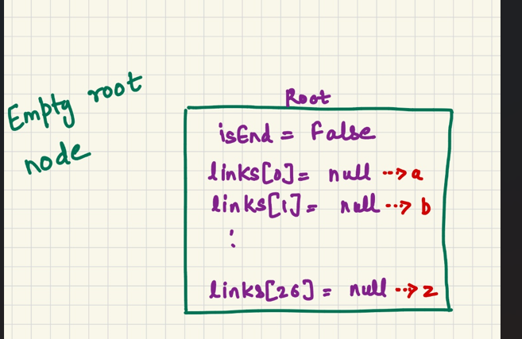
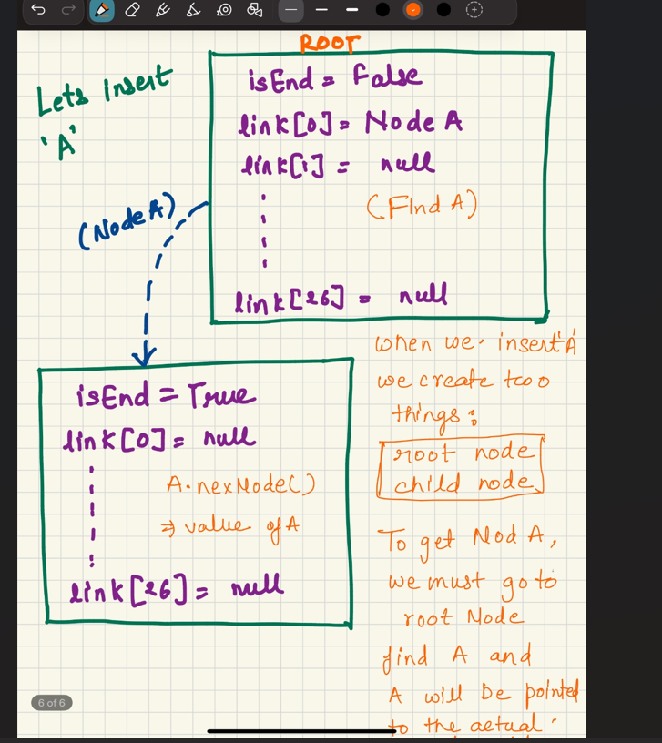
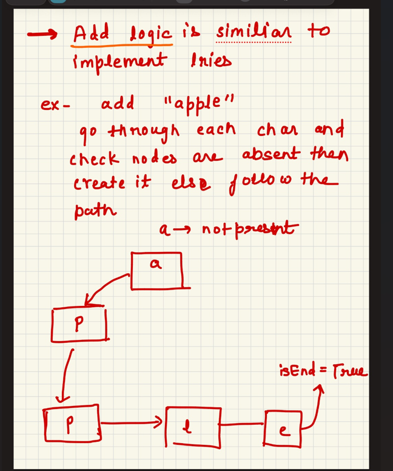
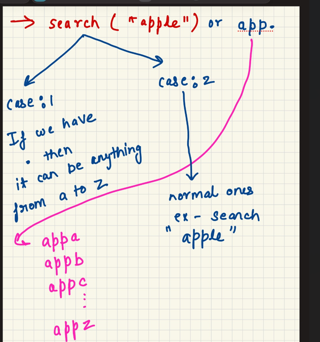
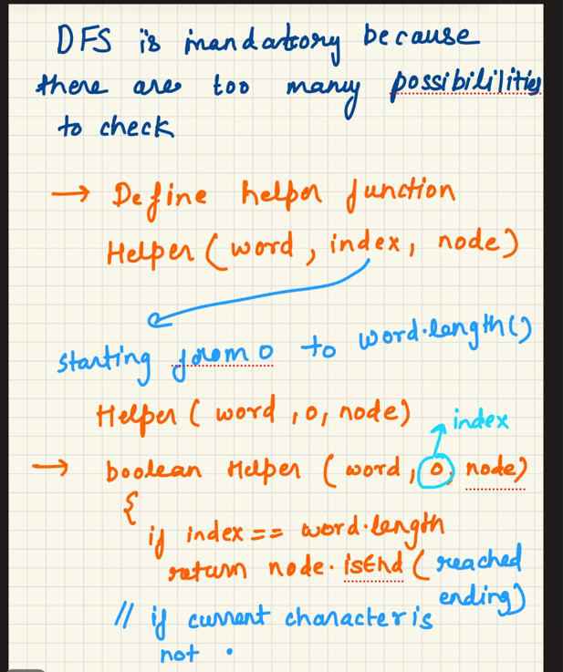
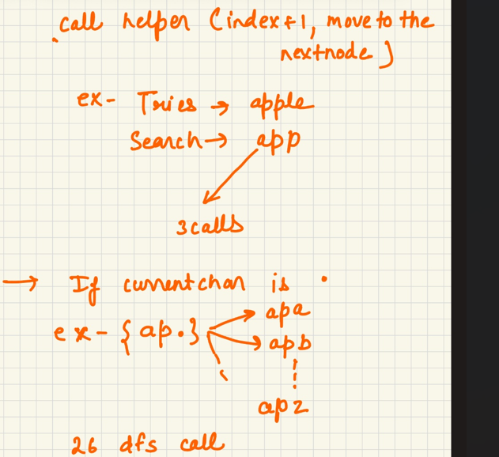

Implement tries:

Creating Tries from scratch 

class TrieNode
{

TrieNode [] links=new TrieNode[26];
boolean isEnd=false;

}

Empty Node:

When we insert something lets say 'A'

insert("apple")

1. Walk down the Trie, character by character.

2. If the branch for a character doesn't exist, create it.

3. If it exists, follow it.

4. After the last character, mark the node as a complete word.

search("apple")

1. Start at the root.

2. For every letter in the word:

    If the path for this letter does not exist then The word is not in the Trie
    , Move to the node for this letter.

3. After all letters are processed:
If the final node is marked as a word end:
Return true (word exists)
Otherwise:
Return false (only a prefix, not the whole word)

StartsWith("app")

1. Start at the root.

2. For every letter in the prefix:
If the path for this letter does not exist:
The prefix does not exist.

    Move to the node for this letter.

3. After all letters are processed:
Return true (the prefix exists, even if no word ends here)

word dictionary :

Similar to implement tries but search logic is different 

